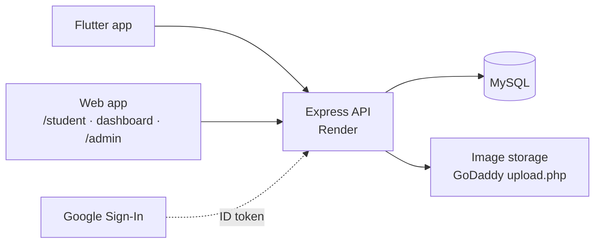

<div align="center">


# Spotlight

**Campus event platform for Ramaiah Institute of Technology.** Students discover and register for club events, clubs manage registrations and check people in by QR code, and an admin controls which clubs can join.


</div>

## What's in this repo

| Folder | What it is | Stack |
|---|---|---|
| [`spotlight_backend/`](spotlight_backend) | REST API used by every client | Express 5, TypeScript, Prisma 7 (MariaDB/MySQL adapter) |
| [`spotlight_dashboard/`](spotlight_dashboard) | One web app with three areas, chosen by URL path | React 18, Vite 6, Tailwind 4, zustand |
| [`spotlight_flutter/`](spotlight_flutter) | Student Android app ([Google Play](https://play.google.com/store/apps/details?id=com.spotlight.connect)) | Flutter, Provider |
| [`spotlight_privacy_policy/`](spotlight_privacy_policy) | Hosted privacy policy page | Static HTML |

The web app serves:

| Path | Area | Who uses it |
|---|---|---|
| `/student` | Student web app (installable PWA, same features as the Flutter app) | Students |
| `/admin` | Admin console: approve or reject club registrations | Platform admin |
| everything else | Club dashboard: create events, review registrations, scan tickets | Club organisers |

## Features

**Students** (Flutter app and `/student`)
- Browse upcoming events by category, search, and save events
- Register solo, create a team, or join one with a 5-character passkey
- Paid events: pay the club by UPI (QR code or UPI ID), then submit the UPI Transaction ID
- QR ticket for every confirmed registration
- In-app notifications, light and dark themes

**Clubs** (dashboard)
- Sign up with club details (department, description, coordinator); sign-in opens once the admin approves
- Create free or paid events with banner, deadline, team size and UPI details
- Approve or reject paid registrations after checking the Transaction ID
- Scan student QR tickets at the venue to check them in
- Overview stats per event

**Admin** (`/admin`)
- Sign in with email and password or Google
- Review pending club registrations, approve (the club gets an email) or reject with a reason

## Architecture


```mermaid
flowchart LR
    APP[Flutter app] --> API
    WEB["Web app<br/>/student · dashboard · /admin"] --> API
    API[Express API<br/>Render] --> DB[(MySQL)]
    API --> FILES[Image storage<br/>GoDaddy upload.php]
    GOOGLE[Google Sign-In] -.ID token.-> API
```

**Auth:** the API issues its own JWTs (30 days for users, 12 hours for the admin). Students and clubs sign in with email and password or Google; the API verifies Google tokens with `google-auth-library`. Passwords are hashed with bcrypt.

**Images** (event banners, club logos) are uploaded as base64 to the API, which stores them through a PHP endpoint on the GoDaddy host and keeps the URL in the database.

**Email** (club approval, new-club alerts to the admins, password reset codes) goes through a Google Apps Script relay ([`mail-relay/Code.gs`](spotlight_backend/mail-relay/Code.gs)), with Brevo or SMTP as fallbacks.

### Data model

`Profile` (students, plus the built-in `admin`) · `Club` (status `PENDING` / `APPROVED` / `REJECTED`) · `Event` (draft flag, allowed branches; all events are free) · `Team` · `Registration` (check-in time; free registrations are confirmed straight away) · `Notification` · `PasswordReset` (one-time email codes) · `AppSetting` (admin settings such as the new-club alert emails). See [`schema.prisma`](spotlight_backend/prisma/schema.prisma).

Event capacity counts places: one per solo student, one per team.

### API

All routes are served under `/api` (and also at the root, for hosts that strip the prefix).

| Prefix | Purpose |
|---|---|
| `/auth` | Student sign-up and login, Google sign-in, club login, password change, forgot password (email code) |
| `/profiles` | Read and edit profiles (USN and branch are fixed once set), profile stats |
| `/clubs` | Club list and sign-up, admin login, club approvals, admin settings, admin student list and delete, club registrations and stats |
| `/events` | Event list (published only), create, edit, publish or delete drafts, an event's registrations |
| `/notifications` | List, mark read, delete |
| `/` (registrations) | Register, teams, ticket verification and check-in, public stats |

## Getting started

Requirements: Node.js 20+, a MySQL or MariaDB database, Flutter (stable) for the mobile app.

### Backend

```bash
cd spotlight_backend
cp .env.example .env        # fill in DATABASE_URL, JWT_SECRET, etc.
npm install                 # also runs prisma generate
npx prisma db push          # create tables (first time only)
npm run dev                 # http://localhost:5000/api
```

`prisma db push` creates every table on a new database. An existing database is updated with the dated SQL files in [`spotlight_backend/prisma/`](spotlight_backend/prisma) instead (run in date order, each once); they only add tables and columns.

On first start the API creates the `admin` profile. Its password is `ADMIN_INITIAL_PASSWORD` if set, otherwise a random one printed once in the server log. Change it from the admin console after signing in.

### Web app

```bash
cd spotlight_dashboard
npm install
# .env: VITE_API_URL=http://localhost:5000/api and VITE_GOOGLE_CLIENT_ID=...
npm run dev                 # http://localhost:5173  (/student, /admin)
npm run build               # output in dist/
```

### Flutter app

```bash
cd spotlight_flutter
flutter pub get
flutter run --dart-define=API_BASE_URL=http://10.0.2.2:5000/api   # Android emulator → local API
```

Without `--dart-define` the app uses the production API. Release builds need `android/key.properties` and the upload keystore, which are not in the repo.

```bash
flutter build appbundle --release   # build/app/outputs/bundle/release/app-release.aab
```

## Environment variables

**Backend** (`spotlight_backend/.env`, see [`.env.example`](spotlight_backend/.env.example))

| Variable | Required | Purpose |
|---|---|---|
| `DATABASE_URL` | yes | MySQL connection string |
| `JWT_SECRET` | yes | Signs all session tokens |
| `GOOGLE_CLIENT_ID` | yes | Verifies Google sign-in tokens |
| `UPLOAD_SECRET` | yes | Shared secret for the image upload endpoint |
| `GODADDY_UPLOAD_URL` | yes | URL of `upload.php` on the file host |
| `PORT` | no | Defaults to `5000` |
| `ADMIN_INITIAL_PASSWORD` | no | First admin password; random and logged once if unset |
| `CRON_SECRET` | no | Enables `POST /notifications/event-reminders` for a scheduled job (sent as `X-Cron-Secret`) |
| `CAMPUS_TIME_ZONE` | no | Zone event times are entered in, default `Asia/Kolkata` |
| `ADMIN_EMAIL` | no | Admin console sign-in email, default `spotlightapp.help@gmail.com` |
| `SMTP_USER` / `SMTP_PASS` | no | Mail account for club approval emails (Gmail: an App Password); emails are skipped if unset |
| `SMTP_HOST` / `SMTP_PORT` / `MAIL_FROM` / `CLUB_LOGIN_URL` | no | Mail server (default Gmail, 465), sender, and the sign-in link in the email |

**Web app** (`spotlight_dashboard/.env`): `VITE_API_URL`, `VITE_GOOGLE_CLIENT_ID`, and optionally `VITE_BASE_PATH` when hosted under a sub-path.

**Flutter:** `API_BASE_URL` via `--dart-define`.

## Deployment

- **API:** Render, configured in [`render.yaml`](spotlight_backend/render.yaml). [`app.js`](spotlight_backend/app.js) is the entry point when running under cPanel's Node.js app (Passenger).
- **Web app:** built with `npm run build` and served as static files; [`public/.htaccess`](spotlight_dashboard/public/.htaccess) (Apache) and [`vercel.json`](spotlight_dashboard/vercel.json) send every route to `index.html`.
- **Android:** upload the `.aab` to Google Play Console.

## License

[MIT](LICENSE)
